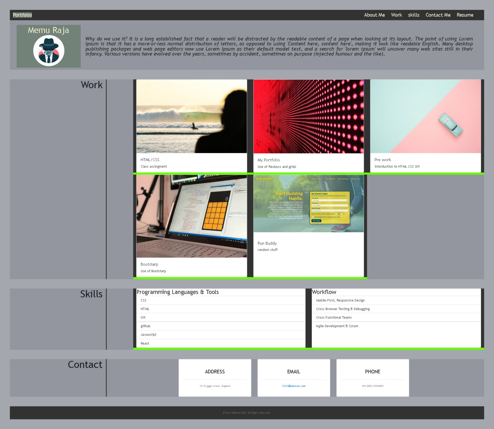

# Bootstrap-Portfolio

## Description
This project is to create porfolio web site using bootstrap. Providing contact infrmation, Personal statment and showcasing links to the some of the project work in work history.

## Challenges
#### Understanding bootstarp 
- What is the purpose
- why we use it
- How to find and use correct bootstrap class
- understanding the columns and rows

## Things I learned
Instead of using the 'px' can use 'rem','em', 'vh' and 'vw' for more reponsieve results for sizing units
pseudo classes and element

## Learning material used
https://developer.mozilla.org/en-US/docs/Web/CSS

https://www.w3schools.com/html/

https://getbootstrap.com/docs/4.3/getting-started/introduction/

https://stackpath.bootstrapcdn.com/bootstrap/4.4.1/css/bootstrap.css

(holds lots of classes and gove you an understanding of what bootstarp classes are doing)

## How portfolio page looks

## Web link
https://ansarraja.github.io/Bootstrap-Portfolio/
